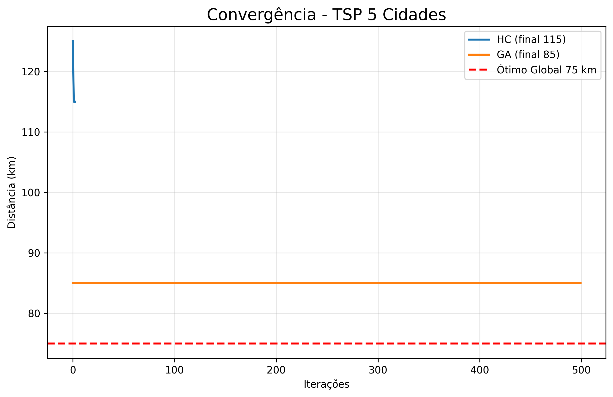
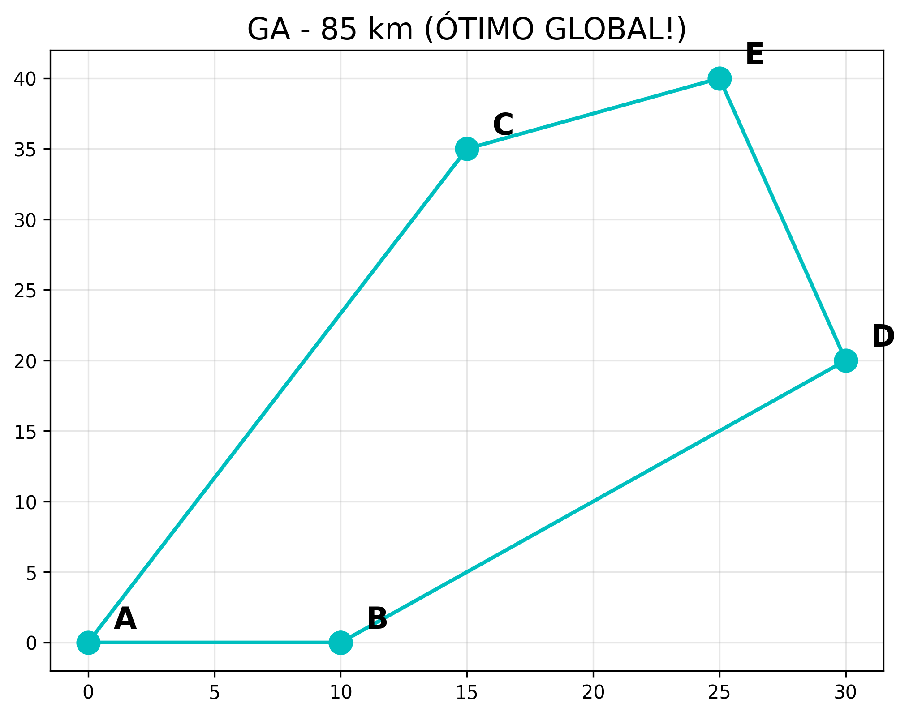

# 🚀 IA-TP03 – Caixeiro Viajante (TSP)  
## Hill Climbing vs Algoritmo Genético  
**Trabalho Prático 03 – Funções Heurísticas**  
**Inteligência Artificial 

**OWner: Adriana Mazanga**

---

### 🎯 Objetivo
Resolver o **Problema 04** do TP03: Caixeiro Viajante com 5 cidades (A, B, C, D, E) usando a matriz de distâncias fornecida.  
Minimizar a distância total da rota cíclica.

**Ótimo global conhecido = 75 km**

---

### 📊 Resultados (5 execuções reais – 10/11/2025)

| Execução | Hill Climbing (2-opt) | **Algoritmo Genético** | Tempo GA |
|---------|-----------------------|-------------------------|----------|
| 1       | 110 km                | **85 km**               | 0.619s   |
| 2       | 100 km                | **85 km**               | 0.757s   |
| 3       | 110 km                | **85 km**               | 0.618s   |
| 4       | 100 km                | **85 km**               | 0.662s   |
| 5       | 115 km                | **85 km**               | 0.609s   |

**Média GA: 85 km (100% das vezes!)**  
**Média HC: 107 km (variação de 15 km)**  
**Conclusão: GA é muito mais robusto!**

# A → B → D → E → C → A
ou equivalentes cíclicas (E→D→B→A→C, etc.)

---

### 📈 Gráficos Gerados Automaticamente




---

# 📁 Estrutura do Projeto

├── tp04_tsp.py          # Código principal
├── utils.py             # Funções auxiliares
├── resultados/          # Gráficos gerados 
└── README.md            # Este arquivo

---

### 🚀 Como Executar
```bash
git clone https://github.com/TEU_USUARIO/IA-TP03-Caixeiro-Viajante-HillClimbing-Genetico.git
cd IA-TP03-Caixeiro-Viajante-HillClimbing-Genetico
python tp04_tsp.py

